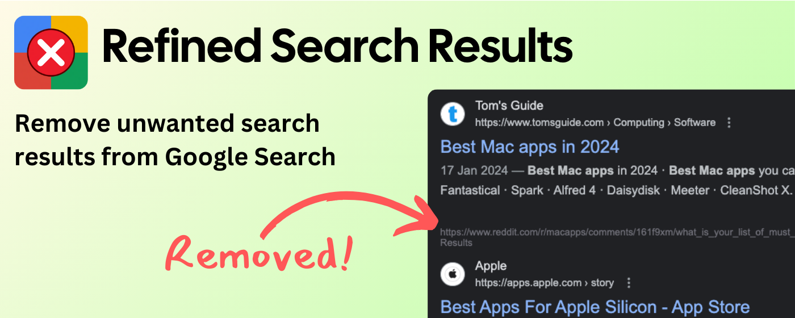
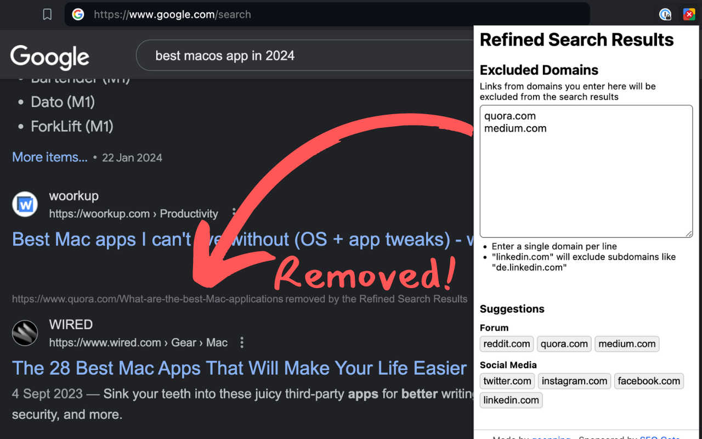

# Refined Search Results

I never click on any `quora.com` links when doing a Google search, and I'm sure many of you have a few websites that you also avoid as much as possible when they show up on your search results.

Maybe you don't like the quality of their content, or they are known for paywalled content, or maybe they just have a terrible user experience. This extension allows you to remove these sites from your search results, to give you more space for the results that actually matter to you.

## How to use it

1. Install the extension
2. Configure the list of domains you don't want to see on Google
3. Enjoy a cleaner search experience ✨

## 📄 License

MIT License

## 💖 Sponsor

This project is open source and free thanks to [SEO Gets](https://seogets.com)

